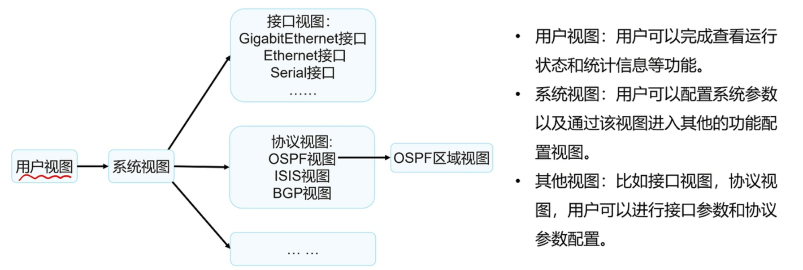
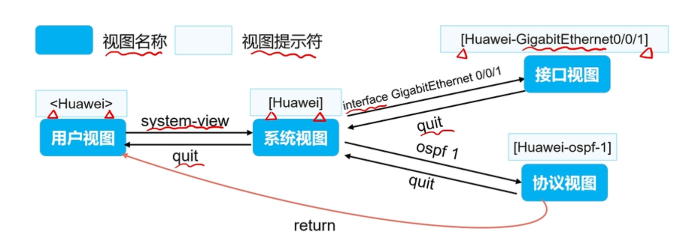
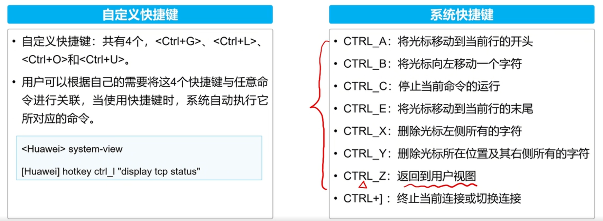
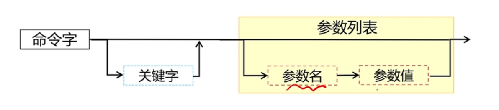

# Versatile Routing Platform 通用路由平台
是华为数据通信产品的通用操作系统平台。以IP业务为核心，采用组件化的体系结构，可以基于应用进行裁剪、扩展.

## 1. 命令视图View
VRP的命令行界面定义了各种命令视图View，针对特定协议或功能进行配置，就需要进入相应的视图。


---

### **1.1 用户视图（User View）**
- **入口**：登录设备后默认进入用户视图。
- **提示符**：`<设备名>`，例如 `<Huawei>`。
- **功能**：  
  - 查看设备运行状态和基本信息（如 `display version`）。
  - 执行基本测试命令（如 `ping`、`tracert`）。
  - 切换至系统视图（输入 `system-view`）。
- **限制**：无法直接进行配置操作。

---

### **1.2 系统视图（System View）**
- **进入方式**：在用户视图下输入 `system-view`。
- **提示符**：`[设备名]`，例如 `[Huawei]`。
- **功能**：  
  - 全局配置设备参数（如主机名、IP地址、路由协议等）。
  - 进入子功能视图（如接口视图、路由协议视图等）。
- **常用命令**：  
  - 退出到用户视图：`return` 或 `Ctrl+Z`。
  - 保存配置：`save`（需在用户视图下执行）。

---

### **1.3 子功能视图**
从系统视图可进入多种子视图，用于具体功能配置。

---

### **1.4 退出视图**
- **逐级退出**：  
  - 子视图 → 系统视图：`quit`  
  - 系统视图 → 用户视图：`return` 或 `Ctrl+Z`  
- **直接返回用户视图**：任何视图下输入 `return`。


## CLI语法检查
|报错概要|原因|解决方法|
|-|-|-|
|`Incomplete command`|命令缺少参数|补全参数或使用 ? 查看帮助|
|`Unrecognized command`|命令不存在或拼写错误|检查拼写或使用 ? 确认合法命令|
|`Ambiguous command`|缩写匹配多个命令|输入更长的缩写或使用 Tab 补全|
|`Wrong parameter`|箭头所指的参数值越界||

## 快捷键

如图。


## 2. 文件系统

VRP系统支持对存储器内文件、目录进行管理。

### 常见文件类型

* 系统文件
  系统软件支撑设备启动、运行、管理、业务等功能。常见文件后缀名为.cc
* 配置文件
  配置文件是用户将配置命令保存的文件，允许设备以指定的配置启动生效，常见后缀名为：.cfg  .zip  .dat
* 补丁文件
  补丁是一种与设备系统软件兼容的软件，用于解决设备系统软件少量且急需解决的问题。常见文件后缀名为：.pat
* PAF文件
  PAF文件是根据用户对产品需要提供了一个简单有效的方式，来裁剪产品的资源占用和功能特性，常见文件后缀名为：.bin

### 文件操作命令
1. 查看当前目录
  pwd
2. 显示目录下文件信息
  dir
3. 查看文本文件具体内容
  more
4. 修改工作目录
  cd
5. 创建新的目录
  mkdir
6. 删除目录
  rmdir
7. 复制文件
  copy
8. 移动文件
  move
9. 重命名
  rename
10. 删除文件
  delete
11. 恢复删除的文件
  undelete
12. 彻底删除回收站中的文件
  reset recycle-bin


### 常见存储设备

* SDRAM
  同步动态随机存储器，系统运行内存，相当于电脑的内存

* NVRAM
  非易失性随机读写存储器，用于存储日志缓存文件

* FLash
  非易失存储器，断电后不会丢失数据，主要存放系统软件，配置文件等；补丁和PAF文件由维护人员上传，一般存储于Flash或SD Card中。

* SD Card
  断电后不会丢失数据，存储容量较大，一般出现在主控板上，可以存放系统文件，配置文件，日志等

* USB
  用于外接大容量存储设备，主要用于设备升级，传输数据。

### 设备初始化过程

设备上电后，首先运行BootROM软件，初始化硬件并显示设备的硬件参数，然后运行系统软件，最后从默认存储路径中读取配置文件进行设备的初始化操作。

BootROM是一组固化到设备内主板上Boot芯片中的程序，它保存着设备最重要的基本输入输出的程序，系统的配置信息，开机后自检程序和系统自启动的程序。

## 设备管理
* Web网管
  通过图形化的操作界面，实现对设备直观方便地管理与维护，但是此实现方式仅可实现对设备部分国内的管理与维护。
  可以通过HTTP、HTTPS方式登陆设备
* 命令行方式
  命令行方式需要用户使用设备提供的CLI对设备进行管理与维护，此方式可实现对设备的精细化管理，要求用户熟悉命令行。
  可以通过Console口，Teknet或SSH方式登录。

## VRP用户界面
当使用CLI方式登录设备时，系统会分配一个用户界面用来管理、监控设备和用户间的当前会话。
设备系统支持的用户界面有Console用户界面和虚拟类型终端VTY (Virtual Type Terminal)用户界面

## VRP用户级别
VRP提供基本的权限控制，可以实现不同级别的用户执行不同级别的command，限制不同用户对设备的操作。

用户级别的命令级别的对应关系如下表：
|用户等级|命令等级|名称|说明|
|:-:|:-:|:-:|:-:|
|0|0|参观级|可以使用网络诊断工具命令(ping、tracert)、从本设备出发访问外部设备的命令(telnet)、部分display命令|
|1|0 and 1|监控级|用于系统维护，可以使用display命令等|
|2|0, 1, 2|配置级|可使用业务配置命令，包括路由、各个网络层次的命令，向用户提供直接网络服务|
|3-15|0, 1, 2, 3|管理级|可使用用于系统基本运行的命令，对业务提供支撑作用，包括文件系统、FTP、TFTP下载、命令级别设置以及用于业务故障诊断的Debugging命令等。|

### 更改当前视图的命令级别
```
command-privilege level [level] view [view-name] [具体完整命令]
```


### 基本命令结构



* 命令字：规定了系统应该执行的功能，如dispaly、reboot
* 关键字：特殊字符构成，用于进一步约束命令，是对命令的扩展，也可用于表达命令构成逻辑而设的补充字符串。
* 参数列表：对命令执行功能的进一步约束。包括一对或多对参数名和参数值。


VRP中，设备配置文件分为**运行配置Current-configuration**和**保存配置Save-configuration**

current-configuration保存在RAM中，Save-configuration保存在Flash中

通过save命令，将current写入flash的默认配置文件(通常是vrpcfg.zip或.cfg)，设备下次启动时，就会加载这次保存的配置

可以指定文件名，如`save test.zip`，但只是备份当前配置到文件，不影响启动配置文件

可以指定路径

通过`autosave interval 周期`，`autosave time 定时`配置自动保存

默认名vrpcfg.zip(压缩格式)或.cfg(纯文本)


`<Huawei>compare configuration`
对比**当前配置**与下次**启动配置文件**的差异

`[Huawei]dis startup`
查看设备下次启动时，将会加载的配置文件和系统软件。
