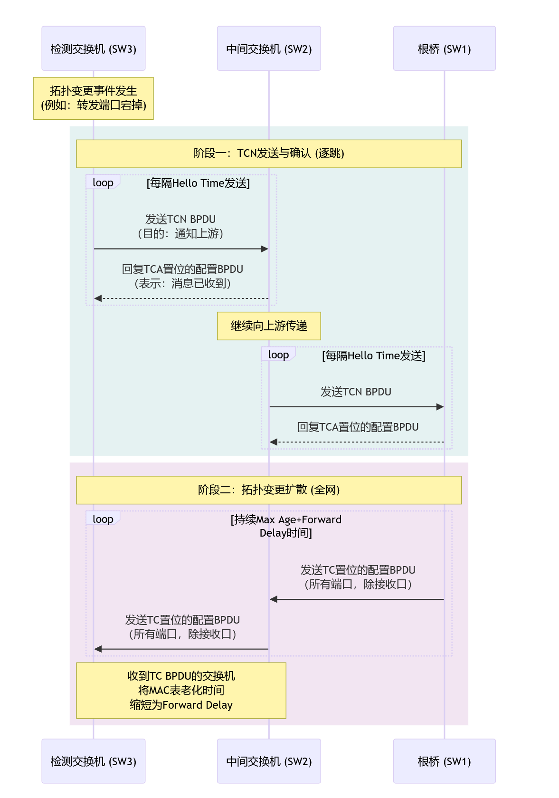

# Spanning Tree Protocol IEEE 802.1D-1998
协议版本

生成树协议（STP）的经典版本定义于 IEEE 802.1D-1998标准。

快速生成树协议（RSTP）​ 最初以修正案 IEEE 802.1w-2001​ 发布，随后被正式纳入 IEEE 802.1D-2004​ 标准，IEEE 802.1D-1998​ 现已被 IEEE 802.1D-2004​取代，在 802.1D-2004及之后版本，RSTP已经成为默认的生成树协议实现，后续的MSTP(802.1s)以802.1w为基础修改。

多生成树协议（MSTP）​ 由修正案 IEEE 802.1s​ 定义，后被整合入 VLAN IEEE 802.1Q-2005​ 标准。

802.1D的D是大写，它是一个完整、独立的主标准，802.1w\s是小写。它们代表一个修正案或补充件。

## 生成树协议概述
STP通过将部分冗余链路强制为阻塞状态，将环形网络结构修剪成无环的树形网络。当处于**转发状态**的端口不可用时，STP将重新配置网络。STP是Layer 2，数据链路层协议

在每个网段上选出一个且仅有一个的指定端口（DP）​ 来负责转发流量，其他到该网段的端口则被阻塞。

由于STP协议收敛时间过长，且阻断的链路没有流量经过，现在已经很少使用STP，更多使用RSTP、MSTP、或者无环网络。

## STP 桥
在STP中，Bridge即为一台交换机设备
* **BID**：Bridge ID，每个桥都有一个唯一的8字节桥ID，
  * BID组成 = 2字节的可配置**桥优先级** + 6字节的**MAC地址**组成，越小越优先。
  * BID一共16位，范围0-61440(65535)，步长4096，默认值32768

### 桥角色
* **RB**：Root Bridge，通过选举一台BID最小的设备（先比较优先级，优先级相同则比较MAC地址，越小越优），称为根桥。在STP topo中为中心设备。

* **NRB**：Non-Root Bridge，非根桥，除了RB，其他都是NRB。每台NRB需要确定唯一的根端口。

* **备用根桥**：部分设备支持设定备用根桥。如果期望一个设备成为备用根桥，设置一个只比根桥BID大，而比其他桥ID小的BID即可。

## STP 端口
### 端口ID：Port ID
  * PID组成 = 端口优先级4位bit + 端口号12位bit
  * 端口优先级为0-240，步长16，默认值128

### 三种端口角色
RB-NRB=根桥:指定端口-根端口:非根桥

NRB-NRB（主干链路）=根桥-非根桥:指定端口-根端口:非根桥

NRB-NRB（冗余链路）=非根桥:指定端口-阻塞端口:非根桥
1. **根端口Root Port**：
    * RP是指向根桥的最优路径（每台NRB上到达根桥的Cost最小的端口），负责转发数据包到根桥（所有需要发送到，或通过根桥的流量都必须通过根端口），始终处于**转发Forwarding**状态，接收并处理最优BPDU。
    * **接收到最优配置BPDU的接口成为RP**
    * 根端口选举：当一个非根桥需要选择根端口时，它会按照以下顺序比较所有接收到的BPDU：

       1. 最小根路径Cost (Lowest Root Path Cost)
       2. 最小发送方BID (Lowest Sender Bridge ID)
       3. 最小发送方PID (Lowest Sender Port ID)

    * 只在非根桥上选举RP
    * 每台非根桥**只能有一个**RP

2. **指定端口Designated Port**：
    * 在每个以太网网段/冲突域上，只能有一个端口被定为**指定端口**

    * 周期性产生并发送最优BPDU，包含了该交换机对根的认知（BID、Cost），用于通知网段上其他设备，其作为指定桥的地位，并帮助其他设备选举它们的RP

    * 对于此端口所属交换机来说，这个端口是它通向下游网段的*指定端口*，也是**下游交换机选举根端口时的上游端口**

3. **阻塞端口Blocked Port**
    * 除了根端口和指定端口以外的所有端口，不转发，用于打破环路。
    * 阻塞端口的另一端是指定端口，阻塞端口只监听，监听指定端口转发的BPDU

### 五种端口状态

1. 禁用状态（Disabled）： 这是一个通过管理命令关闭的端口它不参与 STP 计算，不转发帧，不学习 MAC 地址，也不处理 BPDU.

2. 阻塞状态（Blocking）： 这是大多数端口在交换机上电或端口被识别为冗余路径的一部分时的初始状态。在此状态下，端口不转发用户流量，不学习 MAC 地址。其唯一功能是侦听 BPDU 以确定网络拓扑 。端口通常在阻塞状态下保持 20 秒，然后转换为侦听状态。

3.  侦听状态（Listening）： 这是阻塞状态后的第一个过渡状态。端口不转发帧，不学习 MAC 地址，但它主动发送和接收 BPDU。这允许交换机宣布其存在并参与 STP 选举过程以决定其角色 。端口在侦听状态下保持 15 秒（由转发延迟计时器控制）

4.  学习状态（Learning）： 在侦听状态之后，端口进入学习状态。不转发用户流量，开始学习MAC地址，这使得交换机在端口激活后能够高效地转发帧 。端口在学习状态下再保持 15 秒（也由转发延迟计时器控制）。

5.  转发状态（Forwarding）： 这是端口的正常运行状态，该端口已被选择为活动无环拓扑的一部分（根端口或指定端口）。在此状态下，端口完全参与帧转发并继续学习 MAC 地址，端口保持此状态直到检测到网络拓扑变化。

* 从阻塞到转发需要经过 侦听(15s Forward Delay) 和 学习(15s Forward Delay)

### 接口状态迁移
1. 接口初始化或激活， 
Disabled → Blocking

2. 接口被选举为根端口或指定端口，Blocking状态持续了20秒(Max Age计时器) 
Blocking → Listening

3. 转发延迟计时器超时，接口依然为跟接口或指定接口，Listening状态持续了15秒（Forward Delay定时器） 
Listening → Learning

4. Learning状态持续了15秒(Forward Delay计时器) 
Learning → Forwarding

5. Forwarding/Learning → Blocking
    * 收到更优的BPDU，端口角色发生变化
    * 检测到拓扑变化
    * 链路故障
立即停止转发数据，回到阻塞状态

6. 任何状态 → Disabled
端口被管理员手动关闭或物理链路断开
完全停止所有STP功能

### Cost
每一个激活了STP的接口都维护一个Cost值，主要用于计算根路径开销，接口的缺省Cost除了与其速率，工作模式有关，还与交换机使用的STP Cost计算方法有关，可以使用命令调整接口Cost

802.1D-1998规定的开销
| 链路带宽 | 开销 |
|--------|---------|
| 10 Gbps | 2 |
| 1 Gbps | 4 |
| 100 Mbps | 19 |
| 10 Mbps | 100 |

IEEE 802.1t-2001（独立修正案，被802.1D-2004采纳）
公式：开销 = 200,000,000 ÷ 链路速度(Mbps)

| 链路速度 | 新标准开销值 | 说明 |
|----------|-------------|------|
| ≤ 10 Mbps | 200,000,000 ÷ 速度(Mbps) | 公式计算 |
| 100 Mbps | 200,000 | |
| 1 Gbps | 20,000 | |
| 10 Gbps | 2,000 | |
| 100 Gbps | 200 | |
| 1 Tbps | 20 | |
| 10 Tbps | 2 | |

路径开销计算方法的更新由修正案 IEEE 802.1t-2001​ 定义，它扩展了路径开销的范围并更新了计算表。此项更新与RSTP一同被整合至 IEEE 802.1D-2004​ 标准中，成为后续所有生成树协议（RSTP、MSTP）的默认开销计算标准。

## 计时器
* Hello 时间： 根桥和其他指定端口发送 BPDU 的间隔。默认值为 2 秒 。  

* 最大老化时间（Max Age）：检测故障 
  
    交换机在未收到更新的情况下存储 BPDU 的最长时间，超过此时间则认为到根的链路已失效并启动拓扑更改。默认值为 20 秒（Hello 时间的 10 倍）。如果 BPDU 的消息老化时间（Message Age）超过最大老化时间，则该 BPDU 将被丢弃 。  

* 转发延迟（Forward Delay）： 防止临时换路
  
  此计时器控制端口在 *侦听Listening* 和 *学习Learning* 状态中停留的时间。默认值为 15 秒 。由于端口必须经过侦听和学习状态才能达到转发状态，这意味着在拓扑更改后，端口激活至少需要 30 秒的延迟（15 秒 + 15 秒）。

* 最长收敛时间
  Max Age + Listening + Learning =20+15+15=50s

## BPDU
桥协议数据单元 Bridge Protocol Data Unit
在交换机之间交换、用于管理和维护生成树拓扑的信息。
类型：
### 配置 BPDU（CBPDU）
  
  这些是用于建立和维护生成树的主要 BPDU。它们由根桥生成并以固定间隔（默认 2 秒）在整个网络中传播 。它们携带根桥、路径成本和拓扑计算所需的其他参数信息 。  

### 配置BPDU的比较
STP按照以下顺序选择最优BPUD
1. 最小 RBID
2. 最小 RPC
3. 最小发送者BID
4. 最小发送者PID

### 拓扑更改通知BPDU（TCN BPDU）

* TCN BPDU核心目的：NRB检测到网络拓扑发生变更，发送 TCN BPDU 单播通知根桥，以便根桥启动一个全局机制，让网络中所有交换机在短时间内(老化时间从300s 缩短为Forward Delay 15s)老化掉其MAC地址表中的动态条目

* RB收到 TCN 后，会发送一个设置了 TC 位的配置 BPDU，通知所有其他交换机快速老化其 MAC 地址表，以避免流量黑洞 。   

* 什么情况会触发TCN BPDU
1. 端口转变为Forwarding，特指那些 ***“曾经是网络活动转发拓扑的一部分（曾经是根端口或指定端口），后来失效，又恢复的端口”***，这种情况下它会改变现有活动拓扑。
2. 端口从Forwarding或Learning转变为Blocking或Down状态
**Blocking转变为Forwarding不触发TCN**，激活一条新的、之前未被使用的路径，不会扰乱现有的通信，因此不需要触发TCN。

1. TCN发送与确认
   1. 发起：检测到拓扑变更的交换机，从其**根端口**开始，持续每隔Hello Time向上游发送TCN BPDU。这种BPDU内容简单，不包含任何拓扑信息，只警报。
   2. 中继：上游交换机接收到TCN BPDU后，执行两个动作
      * 向下游回复一个配置BPDU，其中TCA位被置位，相当于确认
      * 中间交换机继续从其根端口转发TCN BPDU
   3. 抵达根桥：直到RB接收TCN BPDU，RB同样回复一个TCA置位的配置BPDU

2. 拓扑变更扩散
   1. 根桥发起通告：RB确认拓扑变更后，会启动一个拓扑变更计时器(Max Age + Forward Delay，通常为35s)，在此时间内，根桥发出的**所有配置BPDU中，TC位都会被置位**
   2. 全网传播：接收到TC置位的BPDU的交换机执行两个动作：
      1. 将TC BPDU从**所有指定端口和根端口转发出去**，除了接收端口，
      2. 将其动态学习到的MAC地址表的老化时间从缺省300s缩短为Forward Delay，缺省15s

### 配置BPDU字段

**一个标准的STP (IEEE 802.1D) 配置BPDU报文包含以下字段，按顺序排列：**

*   **协议标识符 (2字节)**
    *   **定义**：固定为 `0x00`，标识此协议为生成树协议。
*   **协议版本标识符 (1字节)**
    *   **定义**：固定为 `0x00`，标识此BPDU为经典STP版本。
*   **BPDU类型 (1字节)**
    *   **定义**：
        *   `0x00`：配置BPDU
        *   `0x80`：拓扑变更通知BPDU
*   **标志 (1字节)**
    *   **定义**：标志位，STP仅使用了最高两位。位结构为：`[TC][TCA][0][0][0][0][0][0]`
    *   **TC (拓扑变更)**：由根桥设置，用于通知网络中的交换机清空MAC地址表（缩短MAC地址表老化时间)。
    *   **TCA (拓扑变更确认)**：用于响应TCN BPDU，确认收到拓扑变更通知。
*   **根ID (8字节)**
    *   **定义**：当前根桥的桥ID，由桥优先级和桥MAC地址组成。
*   **根路径成本 (4字节)**
    *   **定义**：从发送此BPDU的端口到根桥的累积路径开销。
*   **桥ID (8字节)**
    *   **定义**：发送此BPDU的交换机（指定桥）自身的桥ID。
*   **端口ID (2字节)**
    *   **定义**：发送此BPDU的端口ID，由端口优先级和端口号组成。
*   **消息老化时间 (2字节)**
    *   **定义**：此BPDU自根桥发出以来经过的时间，每经过一个桥增加1（约3.9毫秒），代表处理延迟。交换机在存储BPDU的整个Max Age中递增此值，超过Max Age字段值时丢弃。。**单位：1/256秒**。
*   **最大老化时间 (2字节)**
    *   **定义**：BPDU允许存活的最大消息老化时间，默认值为20秒（`5120`）。
*   **Hello时间 (2字节)**
    *   **定义**：根桥发送配置BPDU的时间间隔，默认值为2秒（`512`）。
*   **转发延迟 (2字节)**
    *   **定义**：端口在侦听状态和学习状态各自需要停留的时间，默认值为15秒（`3840`）。

---

## 选举流程

### 1. Root Bridge 选举过程
1. 初始状态与BPDU发送

   所有交换机启动时，每个端口都初始化为阻塞状态。

   所有交换机都假定自己是根桥，并从所有活动端口向外发送配置BPDU，其中：

       根桥ID字段填写自己的桥ID。

       根路径开销字段填写为0。

       发送者桥ID字段填写自己的桥ID。

2. BPDU接收与最优BPDU比较

   每个端口都会接收来自链路的BPDU。交换机会将接收到的BPDU与本地端口保存的最优BPDU进行比较。

   比较规则即经典的四步法：根桥ID(决定谁是根桥) → 根路径开销(决定非根桥的根端口) → 发送者桥ID(决定网段的指定端口) → 发送者端口ID。数值小者优。

   如果接收到的BPDU更优，交换机将更新该端口的BPDU信息。

3. 角色确定与BPDU转发

   根端口选举：在每个非根桥上，接收最优BPDU的那个端口被选举为根端口。

   指定端口选举：在每一个物理网段上，负责发送最优BPDU的那个端口成为该网段的指定端口。每个网段有且只有一个指定端口。

   阻塞端口：既不是根端口也不是指定端口的端口将被置于阻塞状态。

   BPDU流向：只有根桥会主动周期性地（默认2秒）发送配置BPDU。这些BPDU经由整个树的指定端口逐级向下游转发。非根桥不会主动生成BPDU，它们只在自己的指定端口上转发从根端口收到的、并更新了根路径开销和发送者ID的BPDU。

4. 拓扑变更与收敛

    当链路故障时，下游交换机会因为Max Age计时器超时（默认20秒）而丢失原有的最优BPDU。

    该交换机将重新宣称自己是根桥并发送BPDU，从而触发重新选举。

    端口状态必须经历侦听（15秒） 和学习（15秒） 状态后才能进入转发状态。

    总收敛时间通常为30-50秒。

### 2. Root Port 选举过程
1. 交换机有多个端口接入网络，各个端口都会收到BPDU报文，报文中会携带“RootID、RPC、BID、PID” 等关键字段。

2. 首先比较根路径开销（RPC），STP协议把根路径开销作为确定根端口的重要依据。RPC值越小，越优选，因此交换机会选RPC最小的端口作为根端口。

3. 当RPC相同时，比较上行交换机的BID，即比较交换机各个端口收到的BPDU中的BID，值越小，越优选，因此交换机会选上行设备BID最小的端口作为根端口。

4. 当上行交换机BID相同时，比较上行交换机的PID，即比较交换机各个端口收到的BPDU中的PID，值越小，越优先，因此交换机会选上行设备PID最小的端口作为根端口。

5. 当上行交换机的PID相同时，则比较本地交换机的PID，即比较本端交换机各个端口各自的PID，值越小，越优先，因此交换机会选端口PID最小的端口作为根端口。
---