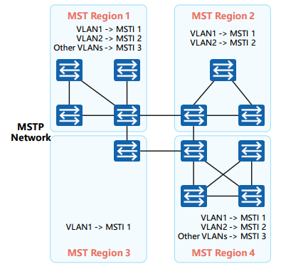
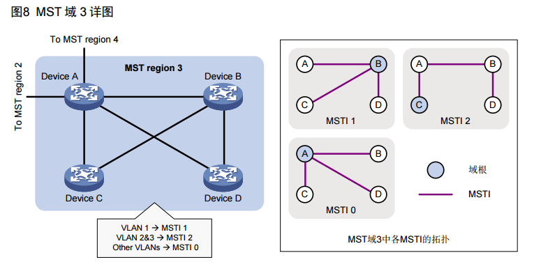

# Multiple Spanning Tree Protocol IEEE 802.1s

## **第一章：MSTP 核心概念与架构**

### 1.1 MSTP 协议定位与演进

802.1D解决了环路问题，但收敛速度慢

802.1w提升了速度

802.1s在.1w的快速收敛基础上，进一步解决了负载均衡的问题。

MSTP兼容STP和RSTP，既可以快速收敛，又提供了数据转发的多个冗余路径。实现数据转发的负载均衡。

MSTP协议，依据三要素，把一个交换网络划分成多个域，每个域内形成多棵实例生成树，生成树之间彼此独立。

* 多生成树实例，就是多个VLAN的集合所对应的生成树。
* 通过将多个VLAN捆绑到一个实例，可以节省通信开销和资源占用率
* MSTP各个实例拓扑的计算相互独立，在这些实例上可以实现负载均衡
* 可以把多个相同拓扑结构的VLAN映射到一个实例里，这些VLAN在接口上的转发状态，取决于接口在对应实例的状态。

IEEE 802.1s为标准协议，几乎所有的ICT厂商都兼容

### 1.2 MSTP 基本架构模型
MSTP的逻辑概念比RSTP多了一些。需要注意分析，避免混淆。

#### * **MSTR(Multiple Spanning Tree Region多生成树域、MST域)** 



MSTR（以下简称域）是一个逻辑概念，是一个**由多台交换机组成的，具有完全一致MSTP配置的，作为一个整体，参与CST公共生成树计算的逻辑分组。**

* 由交换网络中的多台交换设备，以及它们之间的网段所构成。
* 一个局域网可以存在多个MST域，各域之间，在物理上直接或间接相连。
* MSTP网络中包含一个或多个MST域，每个域包含一个或多个MSTI


**域的三大构成要素：**
  * 配置名称/域名 (Configuration Name/Region-Name)
    * 32 Byte 字符串，用于区分不同MSTR，区分大小写，默认为空

  * 修订级别（Revision Level）
    * 16位无符号整数，默认为0，取值0~65535
    * 当域内的VLAN映射关系发生变更时，必须提高修订级别，以通知其他设备配置已更新。

  * VLAN到实例的映射表（VLAN-to-Instance Mapping）
    * ***域最核心的规则***
    * 定义了4096个VLAN到0-4096个实例的映射
    * 交换机会计算128位MD5哈希的配置摘要，并放入BPDU中。邻居设备通过比较BPDU中的这个指纹来判断彼此是否属于同一个域。

三要素都相同，则交换机在同一个MSTR内

域是负载均衡的边界，负载均衡规则只在域内生效。域之间通过一颗简单的**公共生成树（CST）连接**

在CST计算中，整个MSTR被简化视为一台“虚拟交换机”，虚拟交换机的桥ID就是该域的主桥ID，域间交互都通过主桥进行。


#### * **MSTI (Multiple Spanning Tree Instance多生成树实例)** 
MSTI是一个独立的逻辑生成树，每个MSTI在同一个MSTR内，独立进行根桥选举，拓扑计算，端口角色确定。

一个MSTI与一个或多个VLAN绑定。

MSTI实现基于VLAN的负载分担，冗余优化，充分利用网络中的多条链路，避免所有VLAN阻塞在同一链路。

  * Instance ID 

    用户定义的逻辑生成树，每个实例独立计算拓扑。实例ID范围：IEEE 0-63、Huawei、Cisco厂商对实例数量有增强，具体看设备型号，可能为0-4094，为确保多厂商设备兼容性，实例ID应限制在IEEE标准范围内。

  * Instance 0  (IST)

    特殊实例，每个MSTR都强制存在的默认实例，ID固定为0。

#### * **VLAN映射表**
MSTR的一个属性，用来描述VLAN和MSTI之间的映射关系。

#### * **IST（Internal Spanning Tree内部生成树）**
  * Instance 0，每个MST域都强制存在的默认实例
  * 作用：
    * 承载**所有未明确映射到其他实例的VLAN的流量**
    * 作为**区域的骨干树**，连接区域内所有交换机
    * 负责区域间通信的桥梁角色
  * 特性：
    * 根桥称为 IST Regional Root IST区域根
    * 在区域内部，IST是普通生成树。
    * 在区域外部，IST代表整个区域对外呈现。

#### * **CST（Common Spanning Tree公共生成树）**
  * 域间的生成树，连接不同MSTR的虚拟树
  * 作用：
    * 每个MSTR视为一个虚拟交换机
    * 在这些虚拟交换机之间唉，计算一棵无环树
    * ***虚拟网桥BID = 该区域MB的BID***
    * ***虚拟链路的Cost = 区域间实际链路Cost***

#### * **CIST（Common and Internal Spanning Tree公共和内部生成树）**
  * 全网唯一的逻辑生成树
  * CIST = CST + 所有区域 IST
  * 作用：
    * 确保整个交换网络最终形成一颗无环树。
    * 为STP、RSTP提供兼容
    * 选举 CIST Root（全网总根桥）
  * 根桥称为CIST Root，全网唯一
  * 所有设备（STP/RSTP/MSTP）都参与CIST计算
  * 实际控制端口转发状态的最终决策树。

#### * **SST（Single Spanning Tree）单生成树**
  * MST区域内只有一台运行STP/RSTP（非MSTP）交换机时产生
  * 作用：
    * MSTP设备在连接端口上模拟STP/RSTP行为，单交换机区域自动退化SST
  * 特征：
    * 发送标准RSTP BPDU或STP BPDU，不包含MSTI信息
    * 所有VLNA共享转发，不参与MSTP负载均衡

#### 四者关系的可视化与分层理解
```
四者关系的可视化与分层理解
第1层：全网视图
      ┌─────────────────────────────────────┐
      │         CIST (全网唯一树)            │
      │    Common and Internal Spanning Tree │
      └─────────────────────────────────────┘
                 │ 整合所有下层结构
                 ▼
第2层：域间视图
      ┌─────────────────────────────────────┐
      │         CST (域间连接树)             │
      │      Common Spanning Tree           │
      │  (每个区域视为一个"虚拟网桥")         │
      └─────────────────────────────────────┘
                 │ 连接各区域
                 ▼
第3层：域内视图
      ┌─────────────┬─────────────┬─────────────┐
      │ Region A    │ Region B    │ Region C    │
      │   IST       │   IST       │   SST       │
      │ (实例0)     │ (实例0)      │ (单设备区域) │
      └─────────────┴─────────────┴─────────────┘
                 │
                 ▼
第4层：负载均衡层
      ┌─────────────┬─────────────┐
      │   MSTI 1    │   MSTI 2    │ ... MSTI N
      │ (VLAN 10-20)│ (VLAN 30-40)│
      └─────────────┴─────────────┘
```

### 1.2.1 基本架构计算顺序

计算流程：
1. 全网选举CIST Root
   ↓
2. 各区域选举Master Bridge（到CIST Root外部开销最小）
   ↓
3. 各区域内部计算IST（Instance 0）
   ↓
4. 基于IST，各区域作为虚拟节点计算CST
   ↓
5. 整合IST和CST形成完整的CIST
   ↓
6. 各区域内部独立计算各MSTI（1-4094）


---
---
---

## **第二章：MSTP 核心机制**

### 2.1 MSTP BPDU 机制
MSTP BPDU是基于RSTP BPDU的扩展，承载传递多个 MST Instance的配置，状态信息。

#### **结构概览**
**一个标准的MSTP (IEEE 802.1s) BPDU报文包含以下字段，按顺序排列：**
MSTP BPDU基本可以分为三部分：通用部分，MST配置信息，MST实例信息

*   **协议通用部分 (与RSTP兼容，前36字节)**
    *   **Protocol Identifier 协议标识符 (2字节)**
        *   **定义**：固定为 `0x0000`，标识此协议为生成树协议。
    *   **Protocol Version Identifier 协议版本标识符 (1字节)**
        *   **定义**：固定为 `0x03`，标识此BPDU为**Multiple Spanning Tree Protocol**版本。
    *   **BPDU Type BPDU类型 (1字节)**
        *   **定义**：固定为 `0x02`。
    *   **CIST Flags 标志 (1字节)**
        *   **定义**：**字段名变化**。其位定义和顺序与RSTP的Flags字段**完全相同**。位结构为：`[TCA][Agreement][Forwarding][Learning][Port Role][Port Role][Proposal][TC]` (LSB在左)。
        *   该字节承载整个CIST实例的拓扑信息，用于CIST的快速收敛。
            *   0. TCA ​- 在RSTP中此位已被弃用，为向后兼容保留，通常置0。
            *   1. Agreement​ - 同意标志。用于**P/A快速收敛机制中的“同意”消息。**
            *   2. Forwarding​ - 转发状态。置位表示端口处于转发状态。
            *   3. Learning​ - 学习状态。置位表示端口处于学习状态。
            *   4. Port Role​ - 端口角色。00=未知/未用，01=Alternate/Backup。
            *   5. Port Role​ - 端口角色。10=根端口，11=指定端口。
            *   6. Proposal​ - 提议标志。用于**P/A快速收敛机制中的“提议”消息。**
            *   7. TC (Topology Change)​ - 拓扑变更标志。置位时表示网络拓扑发生变化，收到者需刷新MAC表。
    *   **CIST Root Identifier CIST总根ID (8字节)**
        *   **定义**：**字段名变化**。指整个交换网络（所有MST域）中被选举出的**总根桥**的桥ID。
    *   **CIST External Path Cost CIST外部路径开销 (4字节)**
        *   **定义**：**字段名变化**。指**从本MST域的域根**到达**CIST总根**的累计路径开销。这是**跨域**的路径开销。
    *   **CIST Regional Root Identifier CIST域根ID (8字节)**
        *   **定义**：**新增核心概念**。指**本MST域**内到达CIST总根路径最近的桥（即**域根**）的桥ID。此字段是MSTP实现多域分割的关键。
    *   **CIST Port Identifier CIST端口ID (2字节)**
        *   **定义**：**字段名变化**。发送此BPDU的端口，在其所属的**内部生成树(IST)** 中的端口ID。
    *   **Message Age 消息老化时间 (2字节)**
        *   **定义**：同RSTP，单位：1/256秒。
    *   **Max Age 最大老化时间 (2字节)**
        *   **定义**：同RSTP，默认20秒 (`5120`)。
    *   **Hello Time Hello时间 (2字节)**
        *   **定义**：同RSTP，默认2秒 (`512`)。
    *   **Forward Delay 转发延迟 (2字节)**
        *   **定义**：同RSTP，默认15秒 (`3840`)。
    *   **Version 1 Length 版本1长度 (1字节)**
        *   **定义**：固定为 `0x00`，用于向后兼容STP/RSTP。

*   **MST 配置信息 (从第37字节开始)**
    *   **Version 3 Length 版本3长度 (2字节)**
        *   **定义**：**MSTP特有**。指示后续MSTP专有字段的总长度（以字节为单位）。
    *   **MST Configuration Identifier MST配置标识符 (51字节)**
        *   **定义**：**MSTP特有**。用于判断交换机是否属于同一个MST域的“指纹”，包含4个子部分：
            *   **Configuration Identifier Format Selector 配置标识格式选择符 (1字节)**：固定为`0x00`。
            *   **Configuration Name 配置名称/域名 (32字节)**：可读的MST域名。
            *   **Revision Level 修订级别 (2字节)**：无符号整数，用于标识配置版本。
            *   **Configuration Digest 配置摘要 (16字节)**：由VLAN与MSTI映射关系计算出的MD5哈希值。

*   **MST 实例信息**
    *   **CIST Internal Root Path Cost CIST内部根路径开销 (4字节)**
        *   **定义**：**MSTP特有**。发送此BPDU的网桥到达**本MST域的域根（CIST Regional Root）** 的路径开销。这是**域内**的路径开销。
    *   **CIST Bridge Identifier CIST桥ID (8字节)**
        *   **定义**：**MSTP特有**。发送此BPDU的网桥自身在CIST中的桥ID。
    *   **CIST Remaining Hops CIST剩余跳数 (1字节)**
        *   **定义**：**MSTP特有**。该BPDU在MST域内允许被转发的剩余次数，用于限制MST域的范围。每经过一个交换机减1，初始值通常为20。

    *   **MSTI Configuration Messages (MSTI配置信息) (可变长度)**
        *   **定义**：**MSTP核心**。包含0到64个MSTI（多生成树实例）的配置信息，**每个MSTI占16字节**。每个MSTI配置信息包含以下子字段：
            *   **MSTI Flags (1字节)**: 该MSTI的拓扑状态标志。
            *   **MSTI Regional Root ID (8字节)**: 该MSTI在本域内的根桥ID。
            *   **MSTI Internal Root Path Cost (4字节)**: 到达该MSTI域根的路径开销。
            *   **MSTI Bridge Priority (2字节)**: 发送BPDU的网桥在该MSTI中的桥优先级（高4位）和MSTI编号（低12位）。
            *   **MSTI Port Priority (1字节)**: 发送端口的端口优先级（高4位）和端口角色/状态（低4位）。
            *   **MSTI Remaining Hops (1字节)**: 该MSTI BPDU的剩余跳数。


---

### 2.2 MSTP 桥角色
MSTP中的桥角色（RB、备份RB、NRB），在CIST、各MSTI中独立选举存在。

* **CIST RB 公共和内部生成树根桥**

  整个交换网络的唯一总根，计算整个网络CIST的起点，决定所有交换机到达它的总路径成本，跨区域无环拓扑的逻辑参考点。

* **CIST Region RB 公共和内部生成树区域根桥**

  在某个MSTR内部，到CIST RB总路径成本最优的桥。

  它是该区域通往外部网络的逻辑出口，区域内设备以它为跳板，访问CIST RB
  
  如果CIST RB在本域，一般就是CIST Region RB

* **Master Bridge 主桥**

  一个MST Region 对 CIST的总代表，他负责代表整个区域，与区域外CIST进行BPDU交互。CIST Region RB 一定是本区域MB。

  每个MSTR唯一。由区域边界交换机，比较来自区域外的CIST BPDU 选举产生。


* **MST Instance RB 实例根桥**

  某个MSTI在其所生效的VLAN范围内的根桥。

  每个实例在区域内独立选举，一个交换机可以在不同实例中担任不同角色。

* **CIST指定桥**、**MSTI指定桥**

下表为《H3C生成树协议技术白皮书-6W100》定义。

|分类|指定桥|指定接口|
|:----:|:-----:|:-------:|
|对于一台设备而言|与本机直接相连并且负责向本机转发BPDU的设备|指定桥向本机转发BPDU的端口|
|对于一个局域网而言|负责向本网段转发BPDU的设备|指定桥向本网段转发BPDU的端口|


  **注意**：<font color="red">指定桥的选举范围在一个“网段”中，但不是L3的子网概念。<br></font>
  生成树协议中的网段，指的是“桥接段”，“链路段”，“物理段”在点对点全双工链路上，网段指的就是一条单独的链路，在技术文档中，不应当使用”网段“来指代生成树协议中的这一概念。<br>
  在早期集线器型共享式以太网，一个“冲突域”就是一个物理链路网段，生成树协议在这个段上选举指定端口。

  ***指定桥***这一概念在STP、RSTP、MSTP中都存在。但在MSTP中更重要。由于STP、RSTP的单生成树属性，指定端口所在的桥就是指定桥，不必特别说明。

  * CIST 指定桥
    在区域间链路上，代表本区域，向总根（CIST RB）转发CIST BPDU，并确定该链路的CIST指定端口。

    如果域间有多条链路，在CIST中只有一条链路被激活，用于转发流量。其他的链路被阻塞作为备份。MSTP在CIST层面的目标是构建一棵无环的全局树

  * MSTI 指定桥
  SW1 --- SW2
  
  在MSTP中，SW1可能在实例 1上是指定桥，它的指定端口走vlan 10的流量，但在实例 2上它不是指定桥，在实例 2中，SW2才是指定桥，指定端口在SW2 上

### 2.3 桥角色选举

MSTP BPDU优选更复杂，包括在CIST选举，MSTI 选举，BPDU对比也分层，先比较CIST部分，不同区域不对比后续MSTI部分，决定区域间操作，与STP/RSTP操作。再比较MSTI部分，决定区域内负载分担。


第一步：全网交换机参与CIST RB选举，对比BPDU，
1. 比较CIST BID，由CIST优先级+MAC组成，越小越优先。

第二步：确定CIST RB后，每个MST Region独立并行进行选举CIST Region RB,对比BPDU中，
1. 各交换机到CIST总根的路径开销，最小开销交换机成为本区域 CIST Region RB，
2. 开销相同就比较BID.

第三步：这两个通常并行选举

CIST RB和CIST Region RB选举完成后，选举CIST指定桥和

1. 对比CIST RBID，
2. 对比到达总根的路径开销，
3. 对比发送者桥ID（因为有MAC地址，几乎不可能选不出来），
4. 对比发送者端口ID.

各MSTR内，为每个MSTI选举区域内根桥
1. 比较区域内交换机，在该实例的MSTI BID（MSTI 优先级+MAC），越小越优先。这个选举与CIST RB无关。

第四步：选举MSTI指定桥。
1. 区域内每个物理链路上，为每一个MSTI独立进行选举
2. 比较链路两端交换机，到MSTI RB的开销，
3. 开销相同选举MSTI BID，
4. BID相同选举发送端口ID.


### 2.4 MSTP 端口端口角色
* **基础角色** (每个实例独立计算)详见RSTP
  * Root Port 根端口
    * 在NRB上，离RB最近的端口，是本交换机的RP，负责向根方向转发数据。
  * Designated Port 指定端口
    * 负责转发流量与BPDU的端口。
  * Alternate Port 替代端口
    * 一个端口接收到的BPDU等于或优于根端口保存的BPDU，而这个端口又不是根桥，则成为AP，作为根桥的备份。
  * Backup Port 备份端口
    * 一个端口收到本交换机从另一个端口发出的BPDU，说明此端口产生环路。
    * 作为指定端口的备份，为连接下游交换机提供备份链路。


* **特殊角色** (CIST 层面)
  * Master Port 主端口
    * 定义：MST域 到 CIST 总根的最短路径端口
    * 特性：在所有 MSTI 中角色固定
  * Boundary Port/Region Edge Port 域边缘端口
    * 定义：位于MSTR边缘，连接不同域或 SST单生成树 的端口
    * 行为：运行兼容模式
  * Edge Port 边缘端口
    * 定义：连接终端设备的端口
    * 快速转发机制

### 2.5 MSTP 端口状态。
MSTP中的端口状态有三种，详解RSTP。同一端口在不同MSTI中的端口状态可以不同。


### 2.6 路径开销计算模型
* **外部路径开销**
  * 从主桥到 CIST 总根的域间开销
  * 用于主桥选举
* **内部路径开销**
  * 域内设备到域根的开销
  * 用于实例内根端口选举
* **Master Port 选举逻辑**
  * 比较公式：`内部开销 + 外部开销`
  * 实例：选择总开销最小的端口


---
---
---

## **第三章：MSTP 技术特性**

### 3.1 快速收敛机制
* 继承 RSTP 的 P/A 握手机制
  * 在点对点链路上的应用
  * 多实例环境下的同步处理
* 故障检测优化
  * 直连链路故障：3个Hello Time (6秒)
  * 非直连故障：Max Age (20秒) + 快速切换
* 拓扑变更处理
  * 检测条件：非边缘端口状态变化
  * 泛洪机制：TC 标志位 BPDU
  * MAC 地址表处理：立即清除 (非老化)

### 3.2 负载均衡实现原理
* **基于 VLAN 的流量分流**
  * 不同 VLAN 映射到不同 MSTI
  * 各 MSTI 独立计算最优路径
* **实例化负载分担设计**
  * 场景1：上行链路负载分担
  * 场景2：平行链路负载分担
  * 场景3：复杂拓扑的多路径利用
* **配置策略示例**
```bash
# 示例：双上行负载均衡
MSTI 1: VLAN 10*20 *> 根桥在 SW1
MSTI 2: VLAN 30*40 *> 根桥在 SW2
MSTI 3: VLAN 50*60 *> 根桥在 SW3
```

### 3.3 兼容性与互操作
* **与 RSTP/STP 的兼容**
  * MSTP端口检测BPDU类型，可运行在不同模式上。
  * 域边界端口行为模拟
    * 对外，每个MSTR，向STP/RSTP设备，表现为一个运行在CIST上的虚拟交换机
    * 对内，向MSTR内部，传递各MSTI拓扑信息。
    * 所有VLAN流量，离开MSTR时i，汇聚到CIST路径上。
  * BPDU 格式转换
* **混合网络**
  * 快速收敛，负载均衡可能失效

---
---
---

## **附录：几个表**

### 生成树协议
| 特性 | STP (802.1D) | RSTP (802.1W) | MSTP (802.1s) |
|------|--------------|---------------|---------------|
| 收敛时间 | 30*50秒 | 1*2秒 | 1*2秒 |
| 负载均衡 | 不支持 | 不支持 | 支持 |
| BPDU发送 | 仅根桥 | 所有桥 | 所有桥 |
| 端口状态 | 5种 | 3种 | 3种 |
| 实例数量 | 1 | 1 | 多个 |
| 资源消耗 | 低 | 低 | 中 |

### MSTP 术语
| 术语 | 全称 | 说明 |
|------|------|-----|
| MST Region | Multiple Spanning Tree Region | 多生成树域 |
| MSTI | Multiple Spanning Tree Instance | 多生成树实例 |
| IST | Internal Spanning Tree | 内部生成树 (Instance 0) |
| CST | Common Spanning Tree | 公共生成树 |
| CIST | Common and Internal Spanning Tree | 公共和内部生成树 |
| SST | Single Spanning Tree | 单生成树 |
| Master Port | 主端口 | 域到 CIST 总根的最优端口 |

***