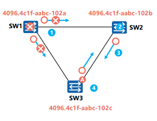
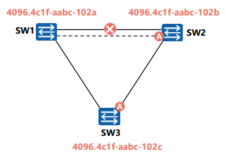
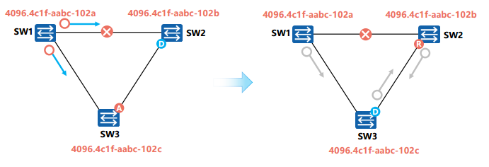
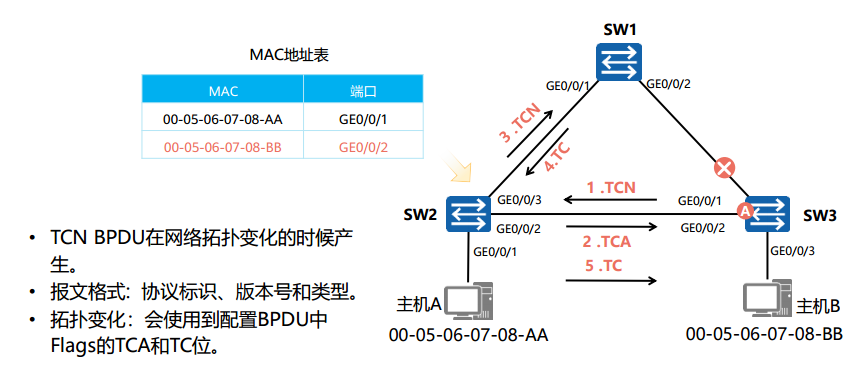

# STP故障情况

## 根桥故障

#### 恢复过程
1. SW1  RB发生故障，停发BPDU
2. SW2等待Max Age超时，20s后，已收到的BPDU报文失效，接收不到根桥发送的新的BPDU，得知上游故障。
3. 非根桥互相发送配置BPDU，选举新根桥
4. 经过重新选举，SW3的A端口，经过两个Forward Delay (15s)后，共计30s，恢复转发状态

#### 根桥故障
* 在稳定的STP网络，NRB会定期收到RB发送的BPDU
* 如果RB发生故障，停发BPDU，下游交换机就收不到根桥的BPDU
* 当Max Age计时器(20s)超时，已收到的BPDU失效，此时非根桥会互相发送 配置BPDU，选举新RB

#### 端口状态
1. SW3的预备端口一开始处于Blocked状态，
2. Max Age计时器超时，进入Listening状态，
3. 在侦听15s后(第一个Forward Delay计时器)，进入Learning状态，
4. 学习15s后(第二个Forward Delay计时器)，进入Forwarding状态，进行转发。

#### 收敛时间
**Max Age (30s) + Forward Delay (15s) + Forward Delay (15s) = 约50秒**，实际情况可能更长。

## 直连链路故障、物理链路故障

在本拓扑中，SW1 - SW2线路故障，比如网线断开
#### 恢复过程
当交换机SW2 网络稳定时，检测到根端口链路故障(物理层检测Down等)，其备用端口会经过两倍Forward Delay(15s)时间，进入用户流量转发状态。**因为物理层检测到故障，所以桥不需要等待Max Age超时才认为故障。**

1. SW2检测到物理端口Down，将预备端口转换为根端口
2. 备用端口经过30s，恢复转发状态。

#### 端口状态
1. 备用端口从Blocking状态，进入Listening-Learning-Forwarding状态，历经两个Forwar Delay计时器。

#### 收敛时间
两个Forward Delay计时器，30s

## 非直连链路故障、非物理链路故障

在本拓扑中，SW1 - SW2线路故障，但物理层无法检测故障

#### 恢复过程

在稳定的STP网路中，NRB会定期收到来自根桥的BPDU报文
1. 当SW1 - SW2线路故障，SW2一直收不到来自根桥的BPDU，Max Age超时，已收到的BPDU失效
2. NRB SW2会认为根桥失效，并认为自己是根桥，从而发送自己的配置BPDU给SW3，通知SW3，2是新根桥
3. SW3收到来自SW2的非最优BPDU，会将从根桥收到的最优BPDU转发给SW2
4. SW2发现来自SW3的BPDU更优，放弃宣称自己是根桥，重新选定端口角色
#### 端口状态
1. SW2在Max Age超时(20s)后，BPDU老化，端口从Blocking进入Listening状态，认为自己是新根桥，0-20s
2. Listening状态下，第一个Forward Delay计时器(15s)启动，BPDU交互，SW2认同SW1为根桥，端口变成根端口，进入Learning状态，20-35s
3. Learning状态下，第二个Forward Delay计时器(15s)启动，SW2开始学习MAC地址，35-50s
4. 约50s后，端口进入Forwarding状态，正常转发

#### 收敛时间

同根桥故障，1个Max Age计时器 + 2个Forward Delay计时器，20+15+15=50s

## 拓扑变化导致MAC地址表错误

交换机依赖MAC地址表转发数据帧，MAC地址表的缺省老化时间是300s，如果生成树拓扑发生变化，交换机转发数据的路径也会随着发生变化，此时MAC地址表中未及时老化的表项会导致转发错误，因此需要在拓扑发生变化后及时更新MAC地址表。

拓扑变更通知，依赖TCN PBDU

TCN BPDU
* 拓扑变化过程中，根桥通过TCN BPDU报文获知生成树拓扑里发生了故障。根桥生成
* TC用来通知其他交换机加速老化现有的MAC地址表项。
  
* 拓扑变更以及MAC地址表项更新的具体过程如下：
  1. SW3感知到网络拓扑发生变化后，会不间断地向SW2发送TCN BPDU报文。
  2. SW2收到SW3发来的TCN BPDU报文后，会把配置BPDU报文中的Flags的TCA位设置1，然后发送给SW3，告知SW3停止发送TCN BPDU报文。
  3. SW2向根桥转发TCN BPDU报文。
  4. SW1把配置BPDU报文中的Flags的TC位设置为1后发送，通知下游设备把MAC地址表项的老化时间由默认的300 s修改为Forward Delay的时间（默认为15s）。
  5. 最多等待15 s之后，SW2中的错误MAC地址表项会被自动清除。此后，SW2就能重新开始MAC表项的学习及转发操作。